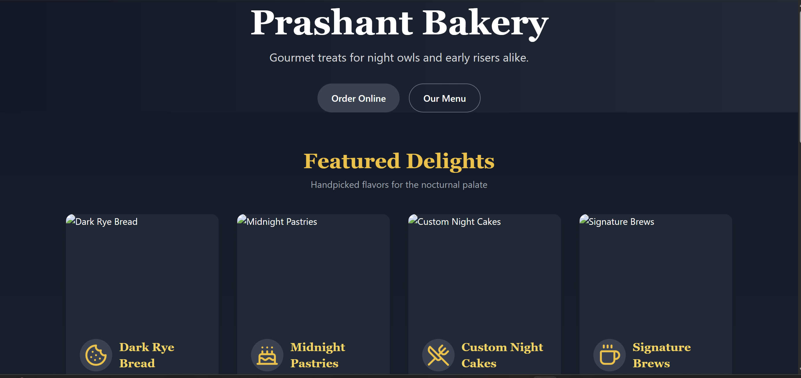
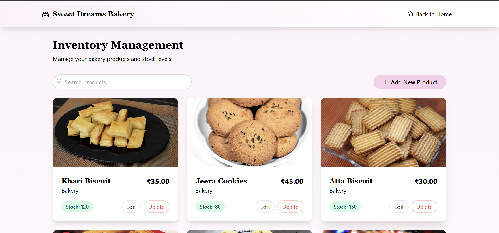
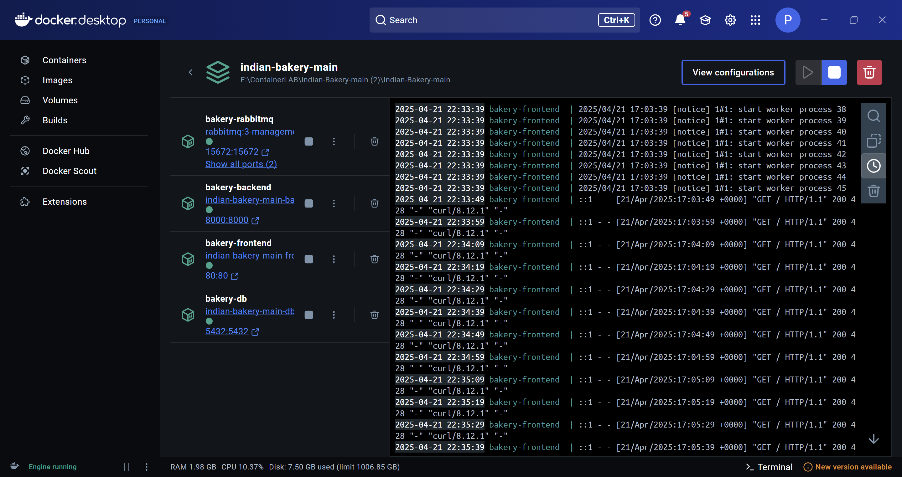

# 🎂 Sweet Dreams – Bakery Inventory Manager

A sleek and powerful inventory system tailored for bakeries, powered by a microservices architecture. Effortlessly manage stock, monitor products, and grow your business.

---

## 🚀 Features at a Glance

| Feature               | Description                                           |
|-----------------------|-------------------------------------------------------|
| 📦 Live Inventory     | Real-time updates and stock tracking                  |
| 🧱 Microservice Design| Each module runs independently for easy scaling       |
| 📈 Visual Analytics   | Track trends with elegant charts *(coming soon!)*     |
| 📱 Fully Responsive   | Optimized for mobile, tablet, and desktop             |

---

## 🛠️ Tech Stack Overview

| Layer               | Stack                                |
|---------------------|--------------------------------------|
| 🖥 Frontend         | React + Vite + Tailwind CSS          |
| ⚙ Backend API      | Node.js + Express                    |
| 🗃 Database         | PostgreSQL                           |
| 🔄 Messaging Queue | RabbitMQ + AMQP                      |
| 📦 Containerization | Docker + Docker Compose              |

---


---

## 📥 Getting Started

### 1. Clone the repo
```bash
git clone https://github.com/Prashantt18/Bakery-Management/tree/main/Indian-Bakery-main
cd Indian-Bakery-main
```
### 2. Configure Environment

Create a `.env` file in the project root with the following contents:

```env
# Database configuration
POSTGRES_USER=prashant
POSTGRES_PASSWORD=pk123
POSTGRES_DB=indianbakery
DB_PORT=5432

# RabbitMQ configuration
RABBITMQ_DEFAULT_USER=username
RABBITMQ_DEFAULT_PASS=userpass
RABBITMQ_HOST=rabbitmq
RABBITMQ_PORT=5672

# Backend environment
DB_HOST=db
DB_USER=prashant
DB_PASSWORD=pk123
DB_NAME=indianbakery

# Frontend build arg
VITE_API_URL=http://localhost:8000
```
### 3. Launch the Platform 🚢
Start all services using Docker:
```
docker-compose up --build -d
```
### 4. Visit the Application 🎉
Open in your browser:
```
http://localhost:80
```
### 5. Outputs
#### 🖥️ Dashboard View  


#### 📦 Product Inventory  


#### 📈 Docker  


